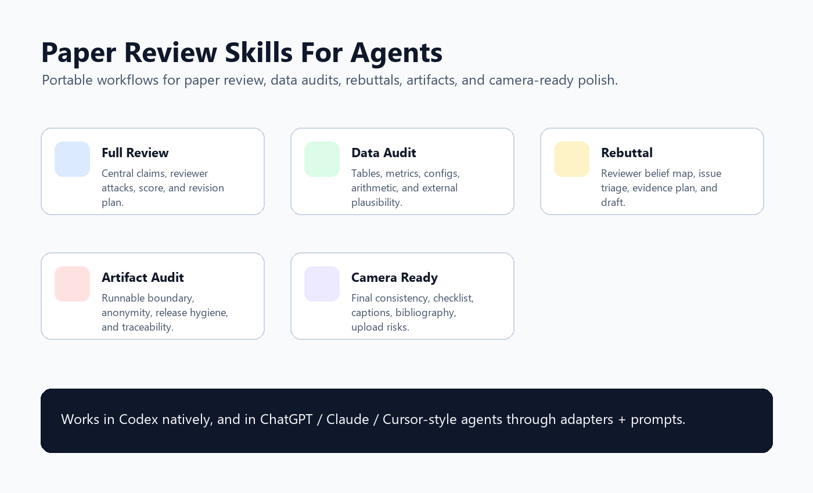
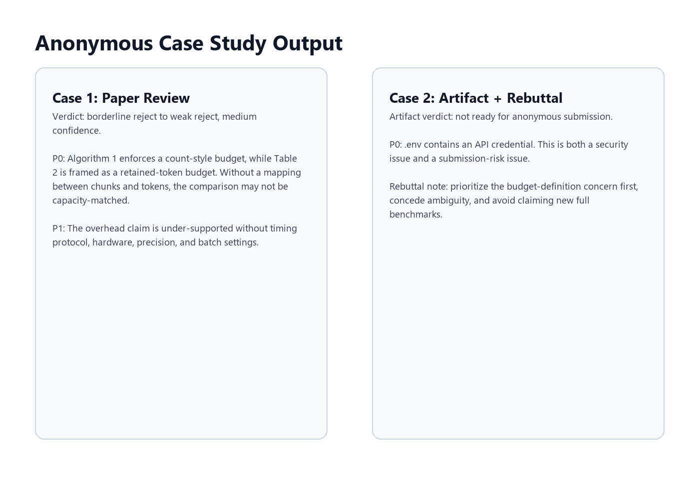

# Paper Review Skills For Agents

[](https://github.com/Sanmu-27/paper-review-codex-skills/actions/workflows/validate.yml)

A portable skill pack for reviewing, stress-testing, and polishing ML/AI research papers across Codex, ChatGPT, Claude, Cursor-style coding agents, and other assistant systems.

The core format is Codex skills, but the repository also includes cross-agent adapters, reusable prompts, examples, and lightweight evals. The goal is practical paper work rather than generic summarization: conference-style review, experimental number auditing, rebuttal planning, artifact release checks, and camera-ready cleanup.



## Skills

| Skill | Use it for |
| --- | --- |
| `ai-paper-review` | Full NeurIPS/ICML/ICLR-style paper review with source, PDF, checklist, bibliography, figure, and artifact checks. |
| `paper-data-auditor` | Auditing tables, reported numbers, system measurements, arithmetic, configs, and external plausibility. |
| `paper-rebuttal-strategist` | Triage reviewer comments, plan evidence, and draft concise rebuttal responses. |
| `artifact-release-auditor` | Check research code or supplement packages for reproducibility, anonymity, security, and release hygiene. |
| `camera-ready-polisher` | Final pass for accepted or near-final papers: claims, checklist, captions, LaTeX/source package, and upload risks. |

## Install

### Codex

Copy any skill folder into your Codex skills directory:

```powershell
Copy-Item -Recurse .\ai-paper-review $env:USERPROFILE\.codex\skills\
```

Restart Codex or open a new thread, then invoke a skill explicitly:

```text
Use $ai-paper-review to review this paper like a rigorous NeurIPS reviewer.
```

Each skill is self-contained and includes its own `SKILL.md`. Some skills include scripts or reference checklists that Codex can load or run when useful.

### Other Agents

Use the files in [`adapters/`](./adapters):

- paste [`adapters/universal-agent-instructions.md`](./adapters/universal-agent-instructions.md) into a system prompt or project instruction field
- use [`adapters/chatgpt-instructions.md`](./adapters/chatgpt-instructions.md) for ChatGPT projects or custom GPTs
- use [`adapters/claude-project-instructions.md`](./adapters/claude-project-instructions.md) for Claude projects
- use [`adapters/coding-agent-rules.md`](./adapters/coding-agent-rules.md) for repo-based coding agents

Then choose a task prompt from [`prompts/`](./prompts).

## Repo Extras

- [`examples/`](./examples) contains sample prompts and a synthetic output excerpt.
- [`examples/case-study-paper-review.md`](./examples/case-study-paper-review.md) and [`examples/case-study-artifact-and-rebuttal.md`](./examples/case-study-artifact-and-rebuttal.md) contain anonymous case studies.
- [`prompts/`](./prompts) contains portable task prompts.
- [`adapters/`](./adapters) contains instructions for non-Codex agents.
- [`evals/`](./evals) contains lightweight fixtures and a 20-point scoring rubric.
- [`scripts/validate_skills.py`](./scripts/validate_skills.py) checks basic skill metadata and prompt wiring.
- [`.github/workflows/validate.yml`](./.github/workflows/validate.yml) runs validation and script compilation on every push and pull request.



## Suggested Workflow

1. Use `ai-paper-review` for the broad conference-style review.
2. Use `paper-data-auditor` when the decision depends on tables, metrics, claims, or system feasibility.
3. Use `paper-rebuttal-strategist` after reviews arrive.
4. Use `artifact-release-auditor` before uploading supplements or code.
5. Use `camera-ready-polisher` for the final accepted-paper pass.

## Notes

- The scripts are conservative scanners. Treat their findings as leads for expert review, not proof of paper flaws.
- When current venue rules matter, verify the official venue instructions before relying on procedural advice.
- These skills are prompt/workflow tools, not a substitute for domain expertise or author judgment.

## Quality Bar

This pack is designed to score well on practical usefulness:

- explicit invocation metadata for Codex
- portable adapters for other agents
- progressive disclosure through `references/`
- deterministic helper scripts for fragile checks
- example prompts and synthetic output
- eval fixtures and scoring rubric
- CI validation for metadata and helper scripts
